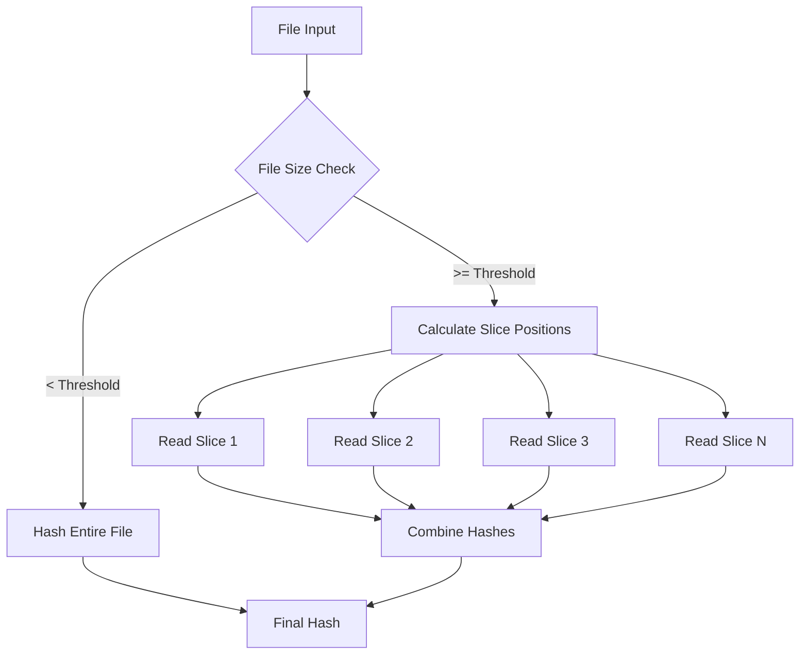
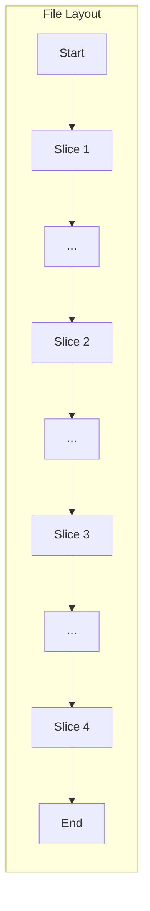

# File Slicing in Smash

This document explains how smash's file slicing algorithm works and why it's effective for finding duplicates in large files (or really blobs of bytes).

While smash only supports file system files, the slicing is designed for cloud storage comparisons (where we don't need to download entire files) and for local file systems where we want to minimize I/O for large files.

## Overview

Instead of hashing entire files, smash divides files into segments and hashes specific slices. This approach significantly reduces I/O for large files while maintaining high accuracy for duplicate detection.

## How Slicing Works

### Basic Process



### Slice Distribution

For a file larger than the threshold, smash distributes slices across the file:



## Parameters

### Slice Configuration

- **`--slices`** (default: 4)
  - Number of slices to extract from each file
  - More slices = higher accuracy but more I/O
  - Range: 1-128

- **`--slice-size`** (default: 8192 bytes)
  - Size of each slice in bytes
  - Larger slices = more data hashed per position
  - Typical range: 4KB-64KB

- **`--slice-threshold`** (default: 102400 bytes / 100KB)
  - Files smaller than this are hashed entirely
  - Prevents overhead for small files
  - Set to 0 to slice all files

### Calculation Example

For a 10GB file with default settings:
- File size: 10,737,418,240 bytes
- Slices: 4
- Slice size: 8,192 bytes
- Total data hashed: 32,768 bytes (0.0003% of file)

## Slice Positioning Algorithm

Smash uses an intelligent positioning algorithm to ensure good coverage:

1. **First slice**: Always at the beginning (offset 0)
2. **Last slice**: Always includes the end of file
3. **Middle slices**: Distributed evenly across the file

### Position Calculation

For a file of size `S` with `N` slices:
```
slice_positions = [
    0,                          # First slice
    S/(N-1),                    # Second slice
    S/(N-1) * 2,                # Third slice
    ...
    S - slice_size              # Last slice
]
```

## Text File Detection

Smash automatically detects text files and may hash them entirely regardless of size:

1. Reads first 8KB of file
2. Checks for text patterns
3. If detected as text and `--disable-autotext` is not set:
   - Small text files: Hashed entirely
   - Large text files: May use different slice strategy

## Benefits of Slicing

### Performance
- **Reduced I/O**: Read only ~32KB instead of entire multi-GB files
- **Faster processing**: 100-1000x speedup for large files
- **Lower memory usage**: No need to load entire files

### Accuracy
- **High duplicate detection rate**: Strategic slice positioning catches most duplicates
- **Configurable precision**: Increase slices for higher accuracy
- **Full hash fallback**: Small files still get complete hashing

### Scalability
- **Network friendly**: Minimal data transfer for remote filesystems
- **SSD friendly**: Reduced wear from reading entire large files
- **Parallelizable**: Each file's slices can be processed independently

## When to Adjust Slicing

### Increase Slices
- Working with similar files (e.g., incremental backups)
- Need higher confidence in results
- Have fast storage (NVMe SSD)

```bash
# High accuracy mode
smash -r --slices=16 --slice-size=16384 ~/backups
```

### Decrease Slices
- Working over slow network connections
- Processing many files quickly
- Initial rough scan

```bash
# Fast scan mode
smash -r --slices=2 --slice-size=4096 ~/network-share
```

### Disable Slicing
- Critical data requiring 100% accuracy
- Small file collections
- Compliance/audit requirements

```bash
# Full file hashing
smash -r --disable-slicing ~/financial-records
```

## Limitations and Considerations

### False Negatives
Slicing may miss duplicates if:
- Files differ only in unsampled regions
- Files have identical sampled regions but differ elsewhere

The probability is extremely low with default settings but increases with fewer slices.

### File Types
Some file types benefit more from slicing:
- **Best**: Media files (video, images, audio)
- **Good**: Archives, databases, disk images
- **Mixed**: Documents (often compressed)
- **Least benefit**: Already compressed files

### Special Cases

#### Sparse Files
Smash handles sparse files correctly, reading actual data blocks rather than zeros.

#### Growing Files
Files being actively written may produce inconsistent results. Smash detects size changes during processing.

#### Encrypted Files
Encrypted files with different keys will appear different even if the plaintext is identical.

## Performance Comparison

Typical performance for a 1GB file:

| Method | Data Read | Time | Accuracy |
|--------|-----------|------|----------|
| Full Hash | 1 GB | 2-5s | 100% |
| Slicing (default) | 32 KB | 10-50ms | ~99.9% |
| Slicing (2 slices) | 16 KB | 5-25ms | ~99% |

## Implementation Details

The slicing implementation can be found in:
- `pkg/slicer/slicer.go` - Core slicing logic
- `pkg/slicer/formats.go` - File type detection

Key functions:
- `SliceFS()` - Main entry point for slicing
- `calculateSlicePositions()` - Determines where to read
- `hashSlices()` - Performs the actual hashing

## Best Practices

1. **Start with defaults**: The default settings work well for most use cases
2. **Test on sample data**: Verify accuracy with known duplicates
3. **Monitor performance**: Use `--nerd-stats` to see slicing efficiency
4. **Adjust gradually**: Change one parameter at a time
5. **Document settings**: Record custom settings for reproducibility

## FAQ

**Q: Will slicing miss duplicates?**
A: Extremely unlikely with default settings. The probability of identical slices in different files is astronomically low.

**Q: Should I disable slicing for important data?**
A: For critical applications where 100% accuracy is required, use `--disable-slicing`.

**Q: How do I know if slicing is working?**
A: Use `--verbose` mode to see slicing decisions for each file.

**Q: Can I change slicing per file type?**
A: Not currently, but this is planned for a future release.
